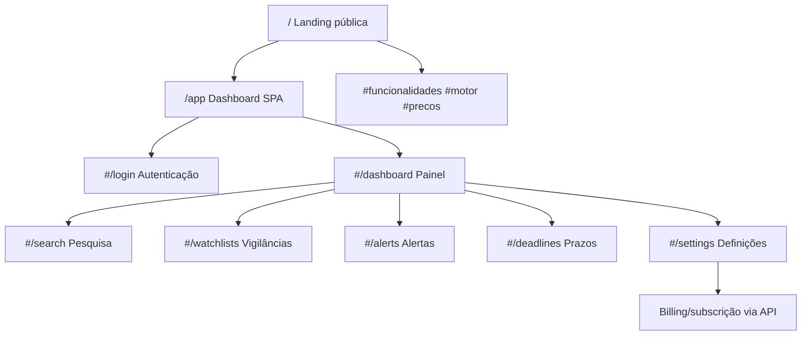
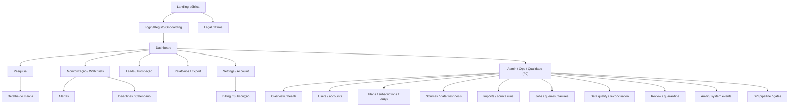

# SITEMAP — markee

Data: 2026-07-24
Versão: 1.0
Autor: Max-2
Âmbito: visão canónica de navegação e rotas baseada no repositório local `/home/batata/projects/markee`.

## 1. Regra de estado

- IMPLEMENTED: existe rota/página em código e há evidência local executável ou teste que cobre o comportamento essencial.
- PARTIAL: existe código funcional, mas faltam testes dedicados, integração real, user-scope completo, UI própria ou contrato de dados final.
- PLANNED: decisão/arquitetura documentada, sem implementação suficiente no código atual.
- BLOCKED: fluxo ou página dependente de decisão/schema/validação legal/dados antes de implementação correta.
- DEFERRED: fora do MVP atual ou dependente de uma decisão posterior.
- OPEN DECISION: ideia ou lacuna sem decisão de produto suficiente.

Nota crítica: documentação antiga não prova estado concluído. `README.md` ainda fala em Streamlit/React, mas o código real serve frontend vanilla por FastAPI. `CLAUDE.md` contém visão alvo útil, mas inclui capacidades que só são parciais ou planeadas.

## 2. Fontes locais auditadas

- Instruções/produto: `README.md`, `CLAUDE.md`, `BRAND_MANUAL.md`, `FEATURES_RESEARCH.md`.
- Estado/backlog: `docs/STATUS.md`, `docs/BACKLOG.md`.
- Dados/schema: `docs/SCHEMA_DESIGN.md`, `docs/DATA_DICTIONARY.md`, `docs/SOURCES_INVENTORY.md`, `docs/adr/0001-use-postgresql-schemas.md`, `docs/adr/0002-versioning-strategy.md`, `docs/adr/0003-inpi-bpi-strategy.md`.
- BPI novo: `docs/research/BPI_VS_EUIPO_GAPS.md`, `docs/research/BPI_AUTOMATED_INGESTION.md`, `docs/research/BPI_DATA_CONTRACT.md`, `config/bpi_event_taxonomy.yaml`.
- Código: `app/main.py`, `app/api/*.py`, `app/services/*.py`, `app/tasks/*.py`, `app/models/*.py`, `alembic/versions/*.py`.
- Frontend: `frontend/landing/*`, `frontend/dashboard/*`.
- Testes: `tests/integration/test_api.py`, `tests/integration/test_watchlists_api.py`, `tests/integration/test_schemas.py`, `tests/unit/*.py`.
- Infra: `docker-compose.yml`, `Dockerfile`, `pyproject.toml`.
- Git status inicial: `?? config/bpi_event_taxonomy.yaml`, `?? docs/research/`.

## 3. Navegação atual implementada

## 4. Navegação alvo conservadora

## 5. Tabela de páginas/rotas frontend

| Route/path | Nome | Estado | Público/privado | Role/persona | Objetivo | CTA principal | Fonte de dados/API | Componentes críticos | Req. | Evidência local |
|---|---|---|---|---|---|---|---|---|---|---|
| `/` | Landing pública | PARTIAL | Público | Profissional PI, advogado marcas, equipa legal, PME | Explicar proposta de valor e levar ao produto | `Começar gratuitamente`, `Entrar` | Sem API direta; assets estáticos; scripts CDN externos | Hero, funcionalidades, preços, CTA, motion/WebGL | FR-LAND-001 | `app/main.py:108`, `frontend/landing/index.html`; sem testes frontend; afirma leitura diária BPI ainda não é produção end-to-end |
| `/#funcionalidades` | Secção funcionalidades | PARTIAL | Público | Comprador/avaliador | Resumir vigilância, prazos, BPI, prospeção | Explorar/entrar | Estático | Painéis de feature | FR-LAND-001 | `frontend/landing/index.html:197`; conteúdo mistura implementado e planeado |
| `/#motor` | Secção motor | PARTIAL | Público | Técnico/decisor | Explicar motores de similaridade/dados | Entrar/experimentar | Estático | Motion + copy | FR-LAND-001 | `frontend/landing/index.html`; sem prova dinâmica |
| `/#precos` | Preços | PARTIAL | Público | Comprador | Mostrar tiers | Entrar/começar | Estático, alinhado com `PLAN_META`/billing mock | Tabela/cartões de planos | FR-BILLING-001 | `CLAUDE.md`, `frontend/landing/index.html`, `frontend/dashboard/app.js:37`; Stripe real não validado |
| `/app` | Shell da aplicação | IMPLEMENTED | Privado na prática por JWT no cliente; ficheiro público | Utilizador autenticado | Entrar no SPA | Login ou navegar | `/api/v1/auth/me` | Hash router, sidebar, topbar, guards por token | FR-AUTH-003 | `app/main.py:95`, `frontend/dashboard/app.js:1342`, testes auth em `tests/integration/test_api.py` |
| `/app#/login` | Login/registo | IMPLEMENTED | Público | Novo utilizador/utilizador existente | Criar conta e iniciar sessão | Iniciar sessão / criar conta | `POST /api/v1/auth/register`, `POST /api/v1/auth/login`, `GET /api/v1/auth/me` | Formulários, localStorage JWT, erros | FR-AUTH-001, FR-AUTH-002 | `frontend/dashboard/app.js:447`, `app/api/auth.py`, `tests/integration/test_api.py` |
| `/app#/dashboard` | Painel | PARTIAL | Privado | Utilizador autenticado | Sumário de vigilâncias, alertas e prazos | Ver pesquisa/vigilâncias | `/watchlists`, `/watchlists/{id}/items`, `/alerts`, `/deadlines` | Cards de stats, listas resumidas, loading/error states | FR-DASH-001 | `frontend/dashboard/app.js:566`; APIs existem; sem testes frontend/e2e; estatísticas/alertas/prazos derivados de BPI estão BLOCKED pelos gates BPI |
| `/app#/search` | Pesquisa de marcas | PARTIAL | Privado | Profissional PI/equipa legal | Pesquisar marcas por texto, jurisdição, classe | Pesquisar | `GET /api/v1/trademarks?q=&jurisdiction=&nice_class=` | Formulário, cards de resultado | FR-SEARCH-001 | `frontend/dashboard/app.js:661`, `app/api/trademarks.py`, `tests/integration/test_api.py`; endpoint usa `ILIKE`, não `pg_trgm` explícito |
| `/app#/marks/{application_number}` | Detalhe de marca | PLANNED | Privado | Profissional PI/equipa legal | Ver histórico, titulares, classes, eventos, documentos | Adicionar a vigilância | `GET /api/v1/trademarks/{application_number}` existe | Página dedicada, timeline, provenance | FR-MARK-001 | API existe (`app/api/trademarks.py:73`), mas não há rota/view frontend dedicada |
| `/app#/watchlists` | Vigilâncias/watchlists | IMPLEMENTED | Privado | Utilizador autenticado | Criar listas de vigilância e itens | Criar vigilância/adicionar marca | `GET/POST/PUT/DELETE /watchlists`, `/watchlists/{id}/items` | CRUD, ownership, thresholds, classes | FR-WATCH-001, FR-WATCH-002 | `frontend/dashboard/app.js:742`, `app/api/watchlists.py`, `tests/integration/test_watchlists_api.py` |
| `/app#/alerts` | Central de alertas | PARTIAL | Privado | Utilizador autenticado | Ver, marcar lido e dispensar alertas | Marcar lido/dispensar | `GET /alerts`, `POST /alerts/{id}/read`, `POST /alerts/{id}/dismiss` | Lista filtrada, badges, ações | FR-ALERT-001 | `frontend/dashboard/app.js:1049`, `app/api/alerts.py`; falta teste dedicado; alertas derivados de BPI estão BLOCKED até GO WITH CHANGES e regra legal validada |
| `/app#/deadlines` | Prazos | PARTIAL | Privado | Profissional PI/equipa legal | Ver prazos próximos | Rever prazo | `GET /deadlines?upcoming_only=true` | Countdown, badges, ordenação | FR-DEADLINE-001, FR-DEADLINE-002 | `frontend/dashboard/app.js:1149`, `app/api/deadlines.py`, `tests/unit/test_lifecycle.py`; falta teste endpoint/user-scope; prazos BPI estão BLOCKED por conflito `+2 meses civis` vs `+60 dias` e validação legal ausente |
| `/app#/leads` | Leads/prospeção | PLANNED | Privado | Profissional PI | Explorar oportunidades comerciais | Ver oportunidades/exportar | `GET /portfolios/{id}/opportunities` existe | Lista leads, scoring, filtros RGPD | FR-LEAD-001 | Serviço e API parcial existem (`app/services/prospection.py`, `app/api/portfolios.py`, `tests/unit/test_prospection.py`), mas sem rota frontend; leads derivados de BPI ficam BLOCKED por gates RGPD/custo |
| `/app#/portfolios` | Portfolios/clientes | PLANNED | Privado | Profissional PI/agência | Gerir carteiras por cliente | Criar portfolio | `/api/v1/portfolios*` | CRUD carteira, marks, oportunidades | FR-LEAD-002 | API existe; frontend não tem página dedicada |
| `/app#/reports` | Relatórios/export | OPEN DECISION | Privado | Profissional PI/gestor | Exportar relatórios para cliente | Gerar export | Desconhecido | Templates, CSV/PDF, permissões | FR-REPORT-001 | Não há rota/API/export no código atual; apenas `is_exported` em `prospection_opportunities` |
| `/app#/settings` | Definições/conta | PARTIAL | Privado | Utilizador autenticado | Ver conta e subscrição | Gerir plano | `/billing/subscription`, `/billing/plans`, `/billing/checkout` | Cartões de plano, dados conta | FR-ACCOUNT-001, FR-BILLING-001 | `frontend/dashboard/app.js:1186`, `app/api/billing.py`; Stripe real não validado |
| `/app#/admin` | Administração/ops | PLANNED/BLOCKED P0 | Privado/admin | `superuser/admin` | Monitorização operacional read-only de plataforma, planos, dados, fontes, importações, jobs, qualidade e saúde | Ver estado operacional; ações mutáveis só quando idempotentes/auditadas/confirmadas | `/health`, `/api/v1/health`, `/api/v1/quality/metrics`; necessários endpoints admin agregados para users, subscriptions, sources, source_runs, jobs, audit e review actions | Overview, subnavegação admin, redaction, RBAC, empty/error states, audit | FR-ADMIN-001..011 | `app/api/quality.py`, `app/models/user.py`, `app/models/subscription.py`, `app/models/source.py`, `app/models/review_queue.py`; sem UI/admin policy/testes deny; BPI subárea BLOCKED pelos gates |
| `/privacy`, `/terms`, `/legal` | Legais | PLANNED | Público | Visitante/comprador | RGPD, termos, política privacidade | Contactar/aceitar | Estático | Conteúdo legal | NFR-GDPR-001 | Não existem ficheiros/rotas; necessário antes de produção pública |
| `/404`, `/500` | Erros | OPEN DECISION | Público/privado | Todos | Erros legíveis e recuperação | Voltar | FastAPI/default + SPA error blocks | Páginas erro | NFR-SEC-001 | Não há páginas dedicadas; há `renderError` no SPA |

### 5.1. Subnavegação alvo `/app#/admin` — P0 operacional

Regra de produto: o portal administrativo P0 é monitorização essencial e operação segura, não substitui Datadog, Stripe Dashboard ou pgAdmin. A base P0 é read-only. Ações mutáveis como retry/replay/cancel/repair só são permitidas quando houver schema/API idempotente, auditoria append-only, RBAC, redaction e confirmação explícita; enquanto isso não existir, ficam PLANNED/BLOCKED.

| Subrota alvo | Página | Estado real | Persona | APIs/tabelas existentes | APIs/tabelas necessárias | Requisito | Informação apresentada | Ações permitidas |
|---|---|---|---|---|---|---|---|---|
| `/app#/admin` ou `/app#/admin/overview` | Overview/health | PLANNED P0 | `superuser/admin` | `/health`, `/api/v1/health`, `/api/v1/quality/metrics`; DB via health/quality parcial | Endpoint admin agregador para DB/workers/Redis/freshness/failures, ou extensão versionada dos endpoints existentes | FR-ADMIN-002, NFR-OBS-001 | Estado API, DB, workers/beat quando suportado, freshness, falhas recentes, contagens essenciais por schema/fonte e backlog review | Read-only no P0; refresh manual seguro |
| `/app#/admin/users` | Users/accounts | PLANNED P0 | `superuser/admin` | `app.users`, `app.subscriptions` | API admin paginada/filtrada com redaction e deny tests | FR-ADMIN-003 | Email/nome/empresa, ativo/inativo, `is_superuser`, plano/subscrição resumida, datas básicas | Read-only P0. Ativar/desativar/role changes BLOCKED até policy/audit/confirm |
| `/app#/admin/subscriptions` | Plans/subscriptions/usage | PLANNED P0 | `superuser/admin` | `/billing/plans`, `/billing/subscription`, `/billing/checkout`, `/billing/webhook`, `app.subscriptions`, constantes `PLAN_META` | API admin para catálogo, plano por user, limites/consumo e health checkout/webhook; indicador mock vs Stripe real | FR-ADMIN-004, FR-BILLING-001..003 | Catálogo, estado por subscrição, limites (`max_marks`, `max_users`, `max_clients`), consumo quando existir, saúde Stripe/mock/webhook | Read-only P0; alteração de plano/cobrança BLOCKED até Stripe/testes/audit/confirm |
| `/app#/admin/sources` | Sources/data freshness | PLANNED P0 | `core.sources`, `core.source_runs`, `raw.api_responses`, `core.trademarks`, `events.lifecycle_events`, schemas raw/core/events/app | API admin de registry/freshness/volumes/last error; redaction de secrets | FR-ADMIN-005, NFR-QUALITY-001 | Fontes registadas, enabled/mode, última execução com sucesso, freshness, volumes raw/core/events/app, erro mais recente | Read-only P0; enable/disable/config BLOCKED até audit/config policy |
| `/app#/admin/imports` | Imports/source runs | PLANNED P0 | `core.source_runs`, tasks `poll_euipo`, `parse_bpi`, ingestion service | Endpoint/listagem detalhada de runs com parser/version, janela, progresso/contagens e drill-down raw/reconciliation | FR-ADMIN-006, NFR-IDEMP-001 | Run status, source, janela, duração, processed/new/updated/failed, parser/version, erros e ligações para raw/reconciliation | Read-only P0. Retry/replay só PLANNED quando idempotente, auditado e confirmado |
| `/app#/admin/jobs` | Jobs/queues/failures | PLANNED/BLOCKED P0 | Celery app/tasks, Redis em infra; não há API job/queue | API segura para schedules, queued/running/failed/dead-letter, heartbeat/last run onde suportado | FR-ADMIN-007, NFR-OBS-001 | Estado de worker/beat, filas, jobs em execução/falhados, dead-letter quando existir, última execução | Read-only quando implementado. Cancel/retry BLOCKED até idempotência/audit/confirm |
| `/app#/admin/quality` | Data quality/reconciliation | PLANNED P0 | `/api/v1/quality/metrics`, `app.review_queue`, confidence/ingestion services | Drill-down por fonte/run/campo, reconciliation/conflicts/duplicates | FR-ADMIN-008, NFR-QUALITY-001 | Completeness, confidence, provenance, duplicados/conflitos, contagens accepted/review/quarantine | Read-only P0; repair/reconcile BLOCKED até schema/policies |
| `/app#/admin/review` | Review/quarantine | PLANNED/BLOCKED P0 | `app.review_queue`, service confidence/ingestion | API de fila, detalhe redigido, decisão auditada, policies de decisão | FR-ADMIN-009 | Fila mínima, item/detail redigido, origem/run/confidence, razão de quarantine/review | Read-only inicial; accept/reject/repair/replay BLOCKED até schema/policy/audit/confirm |
| `/app#/admin/audit` | Audit/system events | PLANNED/BLOCKED P0 | Não confirmado modelo audit específico | Tabela/API append-only para eventos admin, retries/replays, roles/plans/config com redaction | FR-ADMIN-010, NFR-SEC-001 | Alterações admin, roles/plans/config, retries/replays/cancel, actor, timestamp, resultado, correlação | Read-only; escrita só pelo backend auditado |
| `/app#/admin/bpi` | BPI pipeline/gates | BLOCKED P0 | Docs/gates, parser legacy, `review_queue` genérica | `raw.bpi_bulletins`, `raw.bpi_page_extractions`, staging/versionamento, reconciliation/quarantine BPI, gate legal deadlines | FR-ADMIN-011, FR-BPI-001..008 | Estado discovery/archive/extraction/parsing/reconciliation, boletins/datas/páginas/event counts, drift/quarantine, gate jurídico de deadlines | Read-only de gates enquanto NO-GO. Pipeline/actions BLOCKED até BPI-GATE-01..16 |

## 6. Backend/API reais

Base API: `/api/v1`, agregada em `app/api/__init__.py`. Top-level adicional: `/health`.

| Path | Método(s) | Estado | Público/privado | Objetivo | Fonte/tabelas principais | Req. | Evidência local |
|---|---|---|---|---|---|---|---|
| `/health` | GET | IMPLEMENTED | Público | Liveness simples | Sem BD | NFR-OBS-001 | `app/main.py:76`, `tests/integration/test_api.py` |
| `/api/v1/health` | GET | IMPLEMENTED | Público | Health versionado | Sem BD | NFR-OBS-001 | `app/api/health.py` |
| `/api/v1/auth/register` | POST | IMPLEMENTED | Público | Registo | `app.users` | FR-AUTH-001 | `app/api/auth.py`, testes integration |
| `/api/v1/auth/login` | POST | IMPLEMENTED | Público | Token JWT | `app.users` | FR-AUTH-002 | `app/api/auth.py`, testes integration |
| `/api/v1/auth/me` | GET | IMPLEMENTED | Privado | Utilizador atual sem segredos | `app.users` | FR-AUTH-003 | `app/api/auth.py`, testes token/missing/expired |
| `/api/v1/trademarks` | GET | PARTIAL | Público no backend atual; usado como privado pelo SPA | Listar/pesquisar marcas | `core.trademarks`, fallback EUIPO mock | FR-SEARCH-001 | `app/api/trademarks.py`, testes API; sem auth obrigatória; usa `ILIKE` |
| `/api/v1/trademarks/{application_number}` | GET | PARTIAL | Público no backend atual; usado como privado pelo SPA | Detalhe por nº pedido | `core.trademarks`, fallback EUIPO mock | FR-MARK-001 | `app/api/trademarks.py`, testes API; sem página frontend |
| `/api/v1/watchlists` | GET/POST | IMPLEMENTED | Privado | Listar/criar watchlists por user | `app.watchlists` | FR-WATCH-001 | `app/api/watchlists.py`, `tests/integration/test_watchlists_api.py` |
| `/api/v1/watchlists/{watchlist_id}` | GET/PUT/DELETE | IMPLEMENTED | Privado | CRUD watchlist com ownership | `app.watchlists` | FR-WATCH-001 | testes ownership |
| `/api/v1/watchlists/{watchlist_id}/items` | GET/POST | IMPLEMENTED | Privado | Listar/criar itens | `app.watchlist_items` | FR-WATCH-002 | testes items scoped |
| `/api/v1/watchlists/{watchlist_id}/items/{item_id}` | DELETE | IMPLEMENTED | Privado | Remover item | `app.watchlist_items` | FR-WATCH-002 | testes items scoped |
| `/api/v1/alerts` | GET | PARTIAL | Privado | Listar alertas | `app.alerts` | FR-ALERT-001 | `app/api/alerts.py`; sem teste dedicado |
| `/api/v1/alerts/{alert_id}/read` | POST | PARTIAL | Privado | Marcar lido | `app.alerts` | FR-ALERT-002 | `app/api/alerts.py`; sem teste dedicado |
| `/api/v1/alerts/{alert_id}/dismiss` | POST | PARTIAL | Privado | Dispensar alerta | `app.alerts` | FR-ALERT-002 | `app/api/alerts.py`; sem teste dedicado |
| `/api/v1/deadlines` | GET | PARTIAL | Privado | Listar prazos | `app.deadlines`, `core.trademarks` | FR-DEADLINE-001, FR-DEADLINE-002 | `app/api/deadlines.py`; testes só engine lifecycle; deadlines BPI BLOCKED/disabled por default até regra versionada validada |
| `/api/v1/billing/subscription` | GET | PARTIAL | Privado | Ver subscrição | `app.subscriptions` ou mock/default | FR-BILLING-001 | `app/api/billing.py`; Stripe não validado |
| `/api/v1/billing/checkout` | POST | PARTIAL | Privado | Criar checkout | Stripe ou mock | FR-BILLING-002 | `app/api/billing.py`, `app/services/billing.py`; sem chamada real |
| `/api/v1/billing/webhook` | POST | PARTIAL | Externo Stripe | Receber webhook | `app.subscriptions` | FR-BILLING-003 | `app/api/billing.py`; sem teste/Stripe real |
| `/api/v1/billing/plans` | GET | IMPLEMENTED | Público no router atual | Listar planos | Constantes serviço billing | FR-BILLING-001 | `app/api/billing.py`, usado no frontend |
| `/api/v1/portfolios` | GET/POST | PARTIAL | Privado | Carteiras de cliente | `app.client_portfolios` | FR-LEAD-002 | `app/api/portfolios.py`; sem UI dedicada |
| `/api/v1/portfolios/{portfolio_id}` | GET | PARTIAL | Privado | Detalhe portfolio | `app.client_portfolios` | FR-LEAD-002 | `app/api/portfolios.py` |
| `/api/v1/portfolios/{portfolio_id}/marks` | POST | PARTIAL | Privado | Associar marca a portfolio | tabelas app/core | FR-LEAD-002 | `app/api/portfolios.py` |
| `/api/v1/portfolios/{portfolio_id}/marks/{mark_id}` | DELETE | PARTIAL | Privado | Remover marca do portfolio | tabelas app/core | FR-LEAD-002 | `app/api/portfolios.py` |
| `/api/v1/portfolios/{portfolio_id}/opportunities` | GET | PARTIAL | Privado | Oportunidades de prospeção | `app.prospection_opportunities` | FR-LEAD-001 | `app/api/portfolios.py`, `tests/unit/test_prospection.py` |
| `/api/v1/quality/metrics` | GET | PLANNED | Privado? Não confirmado | Métricas de qualidade/provenance | serviços qualidade/raw/core | FR-ADMIN-001, NFR-QUALITY-001 | `app/api/quality.py`; sem UI/admin policy confirmada |

## 7. BPI e ingestão na navegação — decisão NO-GO

Decisão independente: NO-GO para implementar BPI P0 como está.

Confirmado no código atual:
- Existe parser BPI genérico/legacy: `app/services/bpi_parser.py` e task `app/tasks/parse_bpi.py`.
- Existem testes unitários com texto simulado: `tests/unit/test_bpi_parser.py`.
- Existem schemas raw/core/events/app e `app.review_queue` para confidence/quarantine genérica.

Confirmado como não implementado:
- Discovery HTML oficial do INPI, arquivo imutável de PDF, extração por página, contratos/tabelas `BpiBulletinRaw`/`raw.bpi_bulletins`, `BpiPageExtraction`/`raw.bpi_page_extractions`, staging/versionamento de eventos BPI, reconciliação BPI↔core, quarantine BPI específica e UI de revisão.
- `dedupe_key`, `parser_version`, `field_confidence`, supersession, constraints/índices/FKs BPI e unique/upsert transacional.
- Regra legal versionada para deadlines BPI/oposição PT; o estado atual contém conflito `+2 meses civis` vs `+60 dias`.

Estado de produto: BPI automatizado novo fica BLOCKED para P0 operacional. A taxonomia atual é 4 P0 / 13 P1 / 3 P2, com investigação concluída, mas implementação bloqueada. Qualquer página/fluxo que dependa de dados BPI deve aparecer como PLANNED/BLOCKED e nunca como IMPLEMENTED por existirem documentos, YAML ou parser legacy. A landing que afirma “leitura diária” deve ser tratada como promessa de produto, não como facto operacional atual.

Critérios de saída para GO WITH CHANGES:
- fechar os gates BPI de REQUIREMENTS (`BPI-GATE-01..16`), incluindo migrations `raw.bpi_bulletins` e `raw.bpi_page_extractions`, staging/versionamento, dedupe/parser/reconciliation/supersession/quarantine explícitos, constraints/índices/FKs, unique/upsert transacional e fixtures reais;
- congelar deadlines/alertas BPI por default com regra versionada `draft|validated`, `enabled=false`, aprovador/data/base jurídica e uma única semântica temporal validada;
- reconciliar contrato/YAML/source enums/event types/required fields/exemplos/thresholds/ST.17/opposition_filed/RGPD/custo total;
- João decide a equipa de execução depois dos gates; não há atribuição de implementação neste sitemap.

## 8. Fluxos principais e dependências

1. Registo/login
   - `/app#/login` → `POST /auth/register` ou `POST /auth/login` → token JWT → `GET /auth/me` → `/app#/dashboard`.
   - Dependências: `app.users`, `SECRET_KEY`, bcrypt/JWT.

2. Pesquisa e análise de marca
   - `/app#/search` → `GET /trademarks` → resultados → alvo `/app#/marks/{application_number}` ainda PLANNED.
   - Dependências: `core.trademarks`, EUIPO mock/real, pesquisa textual melhorada.

3. Criar vigilância
   - `/app#/watchlists` → `POST /watchlists` → `POST /watchlists/{id}/items` → matching via task futura/serviço.
   - Dependências: auth, ownership, similarity engine, ingestão de novos pedidos.

4. Alertas
   - Ingestão/polling não-BPI → similarity/lifecycle → `app.alerts` → `/app#/alerts` → read/dismiss.
   - BPI→alertas: BLOCKED até GO WITH CHANGES, staging/versionamento/quarantine e regra legal `validated/enabled=true` quando aplicável.
   - Dependências: tasks Celery, alert service, canais email/Telegram se configurados. Sem envio real validado.

5. Prazos
   - Eventos lifecycle/EUIPO não-BPI → deadline engine → `app.deadlines` → `/app#/deadlines`.
   - BPI→deadlines/oposição PT: BLOCKED e disabled por default; depende de BPI-GATE-01/02/13, uma única semântica temporal validada e teste endpoint/user-scope.
   - Dependências gerais: regras legais validadas e testes endpoint.

6. Prospeção
   - Marcas/eventos → prospection service → portfolios/opportunities → UI dedicada ainda PLANNED.
   - BPI→leads/prospeção: BLOCKED até política RGPD/custo total e gates BPI; não expor contactos/listas gerais por defeito.
   - Dependências: filtros RGPD, scoring, export policy.

7. Billing
   - `/app#/settings` → subscription/plans → checkout → webhook.
   - Dependências: Stripe real e secrets; mock atual é útil em dev, não prova cobrança.

## 9. Sitemap mínimo P0

P0 para produto utilizável sem promover decoração a core:

- `/` landing factual, sem claims de ingestão diária até pipeline estar operacional.
- `/app#/login` auth.
- `/app#/dashboard` resumo mínimo.
- `/app#/search` pesquisa básica.
- `/app#/marks/{application_number}` detalhe mínimo com provenance.
- `/app#/watchlists` CRUD + itens.
- `/app#/alerts` alertas com testes dedicados.
- `/app#/deadlines` prazos com teste endpoint/user-scope.
- `/app#/settings` conta básica e plano atual/mock claramente identificado.
- `/app#/admin` portal administrativo mínimo para superuser/admin: overview/health, users/accounts, plans/subscriptions/usage, sources/freshness, imports/source runs, jobs/queues, quality/reconciliation, review/quarantine, audit/system events e BPI gates. Monitorização read-only é P0; mutações ficam bloqueadas até idempotência, auditoria, confirmação e policy.
- Legal mínimo: privacidade/termos antes de produção pública.
- BPI continua NO-GO para pipeline operacional; a subpágina admin BPI deve mostrar estado/gates e blockers sem ativar ingestão/deadlines/alertas.

## 10. Expansão P1/P2

P1:
- UI de portfolios/leads.
- Detalhe de marca com timeline BPI/EUIPO e documentos.
- BPI: fechar gates e obter GO WITH CHANGES antes de qualquer pipeline operacional; discovery/archive/extraction/parser/normalização/quarantine continuam BLOCKED nesta versão.
- Export CSV simples de prospeção/alertas, se RGPD validado.

P2:
- Relatórios PDF/white-label.
- OCR por página para BPI quando necessário.
- Eventos BPI complexos: licenças, retificações, figurativos/logótipos, Vienna avançado.
- SSO/API keys públicas/Enterprise se billing/roles justificarem.
- Calendário visual completo com iCal.

## 11. Inconsistências encontradas

1. `README.md` diz frontend Streamlit→React e `docker compose up app worker beat streamlit`; o código real usa vanilla HTML/CSS/JS servido por FastAPI e `docker-compose.yml` não tem serviço `streamlit`.
2. `CLAUDE.md` lista billing Stripe, alerts email/Telegram, BPI diário e API completa como visão; código atual tem mock/parcial para vários desses pontos.
3. API de `trademarks` está pública no backend, mas o dashboard trata pesquisa como rota autenticada. OPEN DECISION: pesquisa pública vs privada.
4. Existe endpoint de detalhe de marca, mas não existe página frontend de detalhe.
5. Prospeção e portfolios têm API/serviço, mas não têm navegação no dashboard.
6. Portal administrativo é P0 decidido, mas ainda sem UI/admin role/política de acesso/testes deny; `/quality/metrics` e `review_queue` são evidência parcial, não portal completo.
7. BPI parser atual não cumpre o novo contrato BPI: falta discovery, raw archive PDF, extraction por página, taxonomia YAML ligada, normalization/reconciliation/confidence/quarantine BPI-specific.
8. Landing afirma leitura diária do BPI; estado real é parser/task local, não pipeline operacional validado.
9. BPI P0 tem decisão NO-GO como está: persistência/staging/versionamento inexistentes e deadlines contraditórios `+2 meses civis` vs `+60 dias` sem validação jurídica.
10. Billing aparece no UI e API, mas Stripe real não foi exercido; é PARTIAL.
11. Não existem páginas legais/erro dedicadas.

## 12. Contagens neste sitemap

Frontend/páginas por estado:
- IMPLEMENTED: 3
- PARTIAL: 9
- PLANNED: 4
- PLANNED/BLOCKED P0: 1
- BLOCKED: 0
- DEFERRED: 0
- OPEN DECISION: 2

Backend/API por estado:
- IMPLEMENTED: 10
- PARTIAL: 14
- PLANNED: 1
- BLOCKED: 0
- DEFERRED: 0
- OPEN DECISION: 0
