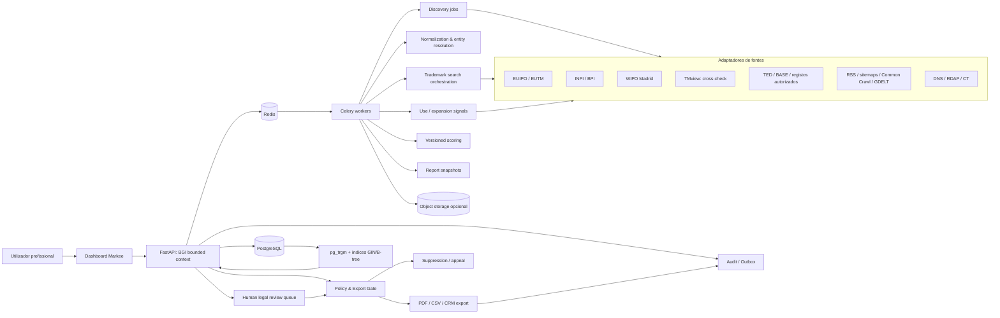

# Markee — Brand Protection Gap Intelligence

## Especificação de Produto e Implementação

**Versão:** 1.0 (reconciliada)  
**Idioma:** Português de Portugal (PT-PT)  
**Estado:** Rascunho para validação P0 — nenhuma decisão abaixo substitui parecer jurídico ou auditoria técnica.

---

## 1. Decisão executiva e problema / JTBD

**Decisão:** Construir o módulo "Brand Protection Gap Intelligence" (BGI) como *bounded context* dentro do Markee existente (FastAPI + PostgreSQL + Celery + Redis), não como microserviço autónomo no MVP.

**Problema central:** Profissionais de propriedade industrial (agentes, advogados, consultores) e equipas corporate de marca dispõem de ferramentas de *watch* e de pesquisa pontual, mas não têm um fluxo sistemático para descobrir, num universo autorizado, marcas com atividade comercial demonstrável cuja proteção registada não foi encontrada nas fontes oficiais cobertas — ou cuja proteção existe apenas num território restrito perante sinais credíveis de expansão.

**Trabalhos do cliente (JTBD):**

1. **Agente/advogado de PI:** "Quero, semanalmente, uma lista curada de leads factuais para verificar se há gap entre uso comercial e proteção registada, sem gastar horas em pesquisa manual cruzada."
2. **Consultor de marca:** "Quero avaliar, com evidência, se vale a pena aconselhar um cliente a ampliar proteção antes de concorrentes ou de imitadores."
3. **Equipa corporate:** "Quero mapear lacunas internas de cobertura territorial ou de classes nas nossas submarcas antes de lançar em novos mercados."

**A mensagem obrigatória em todos os outputs:**

> No matching protection found in covered sources as of `<timestamp>`. Não constitui prova de inexistência de direitos, disponibilidade para registo ou ausência de pedidos não publicados, direitos não registados, marcas notórias, nomes comerciais ou sinais figurativos/compostos.

**Regra de ouro:** o BGI produz *leads de investigação*, nunca pareceres de disponibilidade, avaliações automáticas de "quem tem melhor direito", nem contactos automáticos com titulares.

---

## 2. Âmbito e taxonomia de oportunidades

### 2.1 Âmbito do MVP (90 dias)

- **Territórios cobertos:** Portugal (INPI), proteção unitária da UE (EUIPO/EUTM), designações Madrid para PT e UE.
- **Territórios excluídos do MVP:** Reino Unido, EUA e outros escritórios nacionais da UE fora de PT. Considerados apenas se existir acordo/API confirmado e decisão explícita do owner.
- **Descoberta:** universos-semente autorizados e coortes limitadas (ex.: adjudicatários TED/BASE, listas fornecidas pelo cliente, entidades de programas públicos); sem crawling aberto da Internet.
- **Classes:** Nice 13.ª edição, versão 2026 (NCL(13-2026)), em vigor desde 1 de janeiro de 2026.
- **Sinais de uso:** apenas fontes públicas de acesso técnico autorizado ou oficial; nenhuma fonte protegida por CAPTCHA, login obrigatório ou scraping de interfaces web.

### 2.2 Taxonomia de oportunidades (cinco tipos mutuamente exclusivos)

Cada oportunidade é apresentada numa categoria própria, com cor/etiqueta distinta, e nunca confundida num único score.

| Tipo | Designação | Definição operacional |
|------|------------|----------------------|
| A | Aparentemente não protegida | Uso comercial ativo corroborado por ≥3 fontes independentes (≥1 oficial), sem correspondência exata nas fontes cobertas. |
| B | Registo territorialmente limitado | Proteção ativa em 1 território (ex.: INPI/PT), sem designação Madrid equivalente para UE/PT, mas com sinais públicos de atividade transfronteiriça. |
| C | Lacuna de classes de Nice | Registo ativo em classes parciais; o uso público recai em classes adjacentes não cobertas no registo encontrado. |
| D | Expansão iminente / crescimento | Sinais fortes de entrada em novos mercados (contratação pública no estrangeiro, apps localizadas, distribuidores identificados). Não é gap de registo, é oportunidade de aconselhamento preventivo. |
| E | Proteção estagnada / expiração | Registo existente mas com renovação próxima (<12 meses), recusa, cancelamento ou caducidade, enquanto o uso comercial continua. |

**Separação obrigatória de scores:**
- **Factual registration gap (R):** gap aparente nas fontes cobertas.
- **Evidence / use (U):** força do uso comercial observado.
- **Growth / expansion (G):** intensidade de sinais de crescimento territorial.
- **Source coverage (C):** completude factual da pesquisa executada.
- **Confidence (E):** resolução de entidade e qualidade das fontes.
- **Legal / abuse risk (L):** penalizações e hard holds.

Um **hard legal hold** (ex.: marca notória, conflito de fontes oficiais, pedido recente não visível, sinal predominantemente figurativo) bloqueia exportação independentemente do valor de U ou G.

---

## 3. Utilizadores, workflow e cartão / dossier de oportunidade

### 3.1 Perfis

- **Analista de PI:** cria coortes, tria leads, propõe decisão.
- **Revisor de marcas (obrigatório):** confirma correspondências, classes, designações, figuras.
- **Aprovador jurídico:** resolve holds e aprova relatório/exportação.
- **Operador de fontes:** gere adapters e políticas, sem aceder a dados de outros tenants.
- **Auditor:** leitura de logs e snapshots, sem alteração.

### 3.2 Workflow (estados)

```
descoberta → normalização → resolução de entidade (ou abstenção)
  → inferência de classes → pesquisa de marcas → matriz território×classe
  → sinais de uso/expansão → scoring → triagem
  → review_pending | legal_hold | triaged_out
  → approved_lead → report_ready → export_approved | export_blocked → exported
  → suppressed | appealed | corrected
```

Regras:
- Não saltar de *discovered* para *approved_lead*.
- Alteração material de registo invalida o relatório.
- Nova fonte ou versão de scoring cria nova avaliação.
- Decisões jurídicas são sucedidas, não editadas.

### 3.3 Cartão de oportunidade (campos obrigatórios)

| Campo | Exemplo / formato |
|-------|-----------------|
| ID interno | `BGI-2026-000123` |
| Marca textual | `<texto>` |
| Tipo | A–E |
| Territórios verificados | Lista de jurisdições e fontes consultadas |
| Data da pesquisa | `AAAA-MM-DD HH:MM UTC` |
| Resultado oficial | "No matching protection found in covered sources as of …" |
| Sinais de uso (≥3) | Fonte, URL, hash, data |
| Classes de Nice inferidas | Lista com confiança |
| Lacuna de classes | Classes com uso público sem registo identificado |
| Sinais de expansão | Idiomas, moedas, distribuidores, contratos públicos |
| Sub-scores | C / E / U / G / R / L |
| Score final | 0–100 (se aplicável; hard hold = sem score) |
| Explicação | Texto claro, botão "Porquê esta oportunidade?" |
| Estado | Novo / Em revisão / Aprovado / Arquivado / Legal hold |
| Próxima ação | "Submeter a revisão humana (agente PI)" |
| Disclaimer | "Documento de inteligência — sujeito a revisão por profissional habilitado." |
| Anexos | Dossier PDF, snapshots, hashes |

### 3.4 Dossier de exportação

PDF estruturado com índice, hashes de evidência, referências oficiais, timestamp UTC, nome do revisor e watermark do tenant/utilizador. Inclui o disclaimer obrigatório e a linguagem proibida (ver secção 13).

---

## 4. Fronteira do sistema + modelo de ameaça

### 4.1 Dentro da fronteira

- Ingestão de listas-semente autorizadas.
- Recolha limitada de sinais de uso e expansão.
- Normalização multilingue (conserva original).
- Resolução probabilística de entidades, com abstenção possível.
- Inferência de classes Nice prováveis.
- Pesquisa de registos por jurisdição, classe e variante nominal.
- Modelação de registos internacionais e respetivas designações territoriais.
- Avaliação factual da cobertura pesquisada (C).
- Cálculo de score explicável, separado em componentes.
- Workflow de revisão humana jurídica.
- Supressão, correção e recurso.
- Relatório auditável.
- Exportação controlada para CRM, sem contacto automático.
- Monitorização de fontes, jobs, qualidade e abuso.

### 4.2 Fora da fronteira (o que não faz)

- Parecer de disponibilidade ou aconselhamento jurídico automático.
- Preparação ou submissão de pedidos de marca.
- Aquisição ou sugestão de domínios; monitorização de domínios expirados.
- Contacto com titulares ou utilizadores das marcas.
- Scraping de fontes privadas, autenticadas ou protegidas por CAPTCHA.
- Bypass de autenticação, paywall, robots.txt ou rate limits.
- Recolha de emails, telefones pessoais ou moradas privadas.
- Identificação de beneficiários efetivos.
- Avaliação automática de "quem tem melhor direito".
- Deteção de infração ou *passing off* automática.
- Bases de dados de "marcas vulneráveis".

### 4.3 Modelo de ameaça — ameaças principais

| Ameaça | Cenário | Impacto | Controlo obrigatório |
|--------|---------|---------|----------------------|
| Utilizador mal-intencionado | Procura marcas pequenas para pedidos de má-fé | Crítico | Purpose code, limites por utilizador, revisão jurídica, bloqueio de exportações em massa. |
| Cybersquatter | Usa resultados para registar domínios semelhantes | Crítico | Não mostrar disponibilidade de domínios; não integrar registrars. |
| Consultor agressivo | Contacto coercivo: "registe connosco antes que alguém o faça" | Alto | Sem envio de mensagens; exportação só de leads revistos; termos anti-extorsão. |
| Insider | Exporta toda a lista de candidatos | Alto | RBAC, limite de linhas, watermark, aprovação a quatro olhos, alertas de volume. |
| Concorrente | Pesquisa repetidamente uma marca-alvo conhecida | Alto | Rate limits por entidade, deteção de enumeração, justificação de finalidade. |
| Falha de cobertura | Fonte indisponível interpretada como zero resultados | Crítico | Estados `success`, `partial`, `failed`, `not_covered`; falha nunca equivale a não correspondência. |
| Marca notória | Marca notória sem registo encontrado num território | Crítico | Watchlist interna, sinais de notoriedade, legal hold automático. |
| SSRF / conteúdo hostil | URL interna ou HTML/PDF malicioso como "evidência" | Alto | Egress allowlist, bloqueio de IP privado/metadata, sandbox de parser, limites de redirect/tamanho. |
| Erro de entidade | Confunde utilizador, distribuidor, titular e empresa-mãe | Alto | Relações M:N temporais, confiança explícita, abstenção e revisão humana. |
| Manipulação de score | Utilizador cria sinais artificiais de crescimento | Médio | Diversidade de fontes, caps por domínio, deduplicação, penalização de fontes correlacionadas. |

---

## 5. Matriz de fontes

### 5.1 Registos de marcas (fontes críticas)

| Fonte | Autoridade | Aquisição no MVP | Uso | Limitações | Fallback / gate |
|-------|-----------|------------------|-----|------------|-----------------|
| EUIPO Trademark Search API | Oficial | API oficial, sandbox primeiro. Gate P0: confirmar plano, quota, campos, cache, atribuição, reutilização. | Cobertura EUTM; pesquisa e recuperação de informação. | Limites por plano; OIDC/OAuth. | Fail closed se os termos não cobrirem o produto. |
| TMview (TMDN) | Agregador oficial | Pesquisa manual cruzada no MVP. Feed/API apenas mediante documentação e autorização específicas. | Verificação cruzada multinacional. | Não transforma automaticamente todas as coleções participantes numa pesquisa juridicamente completa. | Verificação humana; não automatizar interface web. |
| WIPO Global Brand Database | Oficial | Pesquisa manual; não fazer bulk download sem licença. | Madrid + coleções nacionais (descoberta). | Não assumir API pública nem direito de descarregar toda a GBD. | Pesquisa dirigida; licença como gate. |
| WIPO Madrid Monitor/Gazette | Oficial | Pesquisa oficial e ingestão autorizada de dados Madrid. | Estado de pedidos e registos internacionais, designações. | Registo internacional não significa proteção automática em todos os territórios. | Verificar designação territorial no instituto designado. |
| WIPO Madrid update files | Oficial | Baseline licenciado/validado + deltas ordenados; checksums e deteção de dias em falta. | Atualização diária de alterações. | Sem baseline completo, os deltas não produzem registo completo. | Gate: baseline confirmado. |
| INPI Portugal — pesquisa | Oficial | Verificação humana dos leads finais. Integração automática só com API/feed ou autorização confirmada. | Registo nacional PT. | Resultados meramente indicativos; INPI recomenda EUIPO/WIPO/TMview. | Verificação humana; sem bypass de CAPTCHA. |
| INPI — Boletim da Propriedade Industrial (BPI) | Oficial | Ingestão de PDF apenas após validação de reutilização; parser versionado. | Pedidos, concessões, recusas, alterações. | PDFs podem exigir OCR e sofrer alterações de formato. | Não usar OCR como conclusão; confirmar no registo oficial. |

### 5.2 Sinais de utilização e expansão (fontes de corroboração)

| Fonte | Utilidade | Aquisição no MVP | Limitações | Decisão |
|-------|-----------|------------------|------------|---------|
| Website oficial, RSS, sitemap | Produtos, países, idiomas, distribuidores | Crawling limitado a domínios já associados ao candidato; respeitar robots/ToS. | Informação promocional, spoofing, copyright. | Fonte primária preferida. |
| TED Search API | Contratos públicos europeus, presença transfronteiriça | API oficial de pesquisa. | Não prova vendas privadas nem uso como marca. | Incluir. |
| Portal BASE (PT) | Contratos públicos portugueses, entidades adjudicatárias | API documentada; validar token, termos e campos no P0. | Token necessário. | Incluir após aprovação P0. |
| BRIS / e-Justice | Confirma existência de empresas e liga aos registos nacionais | Verificação dirigida. | Gateway, não base europeia homogénea nem API bulk confirmada. | Verificação dirigida. |
| Companies House (UK) — futuro | Extensão UK: empresas, nomes, filings | API oficial (fase 2, se decidido). | Dados pessoais de administradores. | Excluído do MVP. |
| DNS / RDAP / Certificate Transparency | Idade técnica de domínio, subdomínios | Apenas para domínio já associado; guardar o mínimo. | Titular pode estar oculto; certificado não prova atividade comercial. | Sinal secundário. |
| Common Crawl | Histórico de páginas sem novo crawl extensivo | Apenas consultas por URL/domínio conhecido. | Direitos de conteúdo original, ToU. | Apenas consulta dirigida. |
| GDELT | Menções em notícias, diversidade geográfica | Metadados e excerto mínimo; não artigos integrais. | Duplicação, ambiguidade nominal, copyright. | Sinal secundário. |

**Excluídos do MVP:** Google Play scraping, Amazon e outros marketplaces sem via licenciada aprovada (incl. eBay), OpenStreetMap Nominatim em massa, Google Places como base persistente, CZDS.

### 5.3 Registo de políticas de fonte

Cada fonte tem configuração versionada com: proprietário, URL da documentação, sandbox/produção, autenticação, rate limit, `robots_policy`, `automation_allowed`, `bulk_download_allowed`, `commercial_reuse_allowed`, `raw_retention_allowed`, `excerpt_display_allowed`, `redistribution_allowed`, atribuição obrigatória, dados pessoais possíveis, copyright/direito sui generis, data da última revisão jurídica, responsável interno, kill switch.

Se `commercial_reuse_allowed` ou `automation_allowed` estiver indefinido, o adapter não entra em produção.

---

## 6. Arquitetura

Diagrama de alto nível, compatível com a stack Markee (FastAPI + PostgreSQL + Redis + Celery + Docker):



**Decisão monólito vs. serviço separado:** MVP como módulo no processo FastAPI existente, workers Celery por fonte, schema PostgreSQL próprio. Separar num serviço autónomo apenas quando: corpus ativo próximo de 1 milhão de candidatos; mirrors de registos exigirem infraestrutura isolada; pesquisa especializada exceder pg_trgm; source workers ameaçarem a disponibilidade do produto principal; equipas e ciclos de release independentes.

---

## 7. Modelo canónico mínimo, estados e proveniência

### 7.1 Princípios

- Separar observação comercial de direito registado.
- Separar pessoa/empresa de marca.
- Separar marca nominativa de figurativa/composta.
- Separar registo internacional das designações territoriais.
- Modelar classes e bens/serviços, não apenas números Nice.
- Conservar história bitemporal; nunca representar falha de pesquisa como "zero resultados".
- Guardar a fonte de cada campo material.
- Partilhar registos oficiais globais, mas isolar candidatos, reviews e exportações por `tenant`.

### 7.2 Entidades principais (resumo)

| Entidade | Invariante chave |
|----------|------------------|
| `candidate_brand` | É um sinal observado, não um direito. |
| `brand_name_variant` | Original nunca apagado ou substituído. |
| `commercial_use_observation` | `use_role`: trade name, product, service, app, domain, shop, company name, etc. |
| `entity` | Pessoa singular só quando estritamente necessária. |
| `entity_relationship` | Relações temporais M:N; não inferir beneficiário efetivo. |
| `trademark_record` | Identidade composta por instituto + número. |
| `registration_jurisdiction` | EUTM não é convertido em 27 registos fictícios. |
| `designation` | Madrid central e instituto designado podem ter estados distintos. |
| `search_run` | Unidade auditável do claim; declara protocolo, territórios, classes, fontes, timestamps, status, cobertura. |
| `coverage_cell` | Célula falhada reduz a cobertura; nunca equivale a "não correspondência". |
| `score_snapshot` | Imutável após publicação; guarda componentes C/E/U/G/R/L. |
| `review_case` / `review_decision` | Estado obrigatório antes de exportação; decisões sucedidas, não atualizadas destrutivamente. |
| `suppression` | Impede reingestão sem conservar dados excessivos. |
| `audit_event` | Append-only, com hash chain. |

### 7.3 Proveniência bitemporal

Todo o dado material suporta: `source_valid_from/to`, `observed_at`, `recorded_at`, `source_published_at`, `adapter_version`, `parser_version`, `normalizer_version`, `model_version`, `source_record_id`, URL oficial, hash do conteúdo, idioma, território, confiança, fundamento, política/licença em vigor no momento da recolha.

---

## 8. Pipeline completo e idempotência

### 8.1 Pipeline

```
seed autorizado
  → descoberta limitada
  → extração de sinais comerciais
  → normalização multilingue (conserva original; Unicode NFKC; limita variantes)
  → resolução de entidade (abstenção possível)
  → inferência de classes/bens (top-N com confiança)
  → pesquisa de marcas (12 protocolos mínimos por candidato)
  → resolução de designações e estado territorial
  → matriz território × classe × variante × fonte
  → sinais de utilização/expansão
  → score explicável (componentes separados)
  → triagem
  → revisão humana jurídica
  → relatório auditável
  → export gate
  → CRM / PDF / CSV auditado
```

### 8.2 Idempotência

Chaves de idempotência:
- `fonte + source_record_id + source_version`
- `candidato + protocolo + protocol_version + reference_time`
- `job_type + object_id + input_hash`

Um retry não pode duplicar evidência, emitir dois relatórios, avançar cursor após processamento parcial, sobrescrever estado histórico ou repetir exportação.

### 8.3 Pesquisa de marcas — protocolo mínimo

1. Correspondência nominativa exata.
2. Variante normalizada.
3. Sem acentos.
4. Com/sem separadores.
5. Tokens invertidos quando plausível.
6. Prefixo/sufixo distintivo.
7. Similaridade trigram.
8. Distância de edição (apenas no top-K).
9. Equivalência fonética por língua (não Soundex global).
10. Transliterações versionadas.
11. Principal elemento verbal de marca composta.
12. Pesquisa de titular e aliases (sem assumir que titular semelhante resolve conflito).

Cada pesquisa declara: fontes, coleções, territórios, classes/bens, variantes, filtros, datas, cursor/versão, resultados, erros, cobertura, revisão.

### 8.4 Cobertura territorial

Para cada território/classe:
- proteção ativa encontrada;
- pedido pendente encontrado;
- direito expirado/cancelado encontrado;
- correspondência ambígua;
- nenhum registo correspondente encontrado;
- fonte falhou;
- território não coberto;
- pesquisa incompleta;
- conflito entre fontes.

Uma marca Madrid só é avaliada por designação. "WO ativo" sem análise da designação PT/UE não é suficiente.

---

## 9. Scoring explícito, separado e com hard gates

### 9.1 O que o score representa

Representa apenas a **prioridade de um lead factual para revisão humana**. Não representa:
- probabilidade de conseguir registar;
- probabilidade de inexistência de direitos;
- parecer de risco de confusão;
- valor económico da marca.

### 9.2 Componentes (0 a 1)

**C — Cobertura factual**

```
C = média ponderada das células obrigatórias:
    disponibilidade da fonte
  × atualidade
  × completude das variantes
  × completude territorial
  × completude de classes/bens
  × qualidade de parsing
```

Uma célula `failed` vale zero. Uma célula `not_covered` permanece explícita.

**E — Confiança de entidade**

```
E = confiança de que:
    o sinal comercial → pertence ou é usado pela entidade identificada
  → e a entidade pesquisada corresponde ao utilizador/titular relevante
```

**U — Força de utilização comercial**

```
U = 0,35 × evidência primária de oferta comercial
  + 0,25 × continuidade temporal
  + 0,20 × diversidade de fontes independentes
  + 0,20 × atividade transacional/institucional
```

Caps: múltiplas páginas no mesmo domínio = uma família; menções replicadas = uma vez; DNS/CT nunca ultrapassam nível de sinal fraco.

**G — Força de crescimento/expansão**

```
G = 0,35 × presença comercial multiterritorial
  + 0,25 × tendência temporal
  + 0,20 × intenção explícita de expansão
  + 0,20 × distribuidores, contratação, apps ou procurement externo
```

**R — Gap aparente de registo**

Para cada território `t` e classe/bens `c`:

```
gap(t,c) =
  1,0  se não foi encontrada proteção correspondente após protocolo completo e fontes bem-sucedidas
  0,5  se existem apenas resultados inativos, ambíguos ou que exigem decisão humana
  0,0  se existe proteção ativa/pendente materialmente correspondente
```

```
R = soma(peso_expansão(t) × confiança_classe(c) × gap(t,c)) / soma dos pesos aplicáveis
```

`R = 1` continua a significar somente "gap aparente no protocolo executado".

**L — Penalizações de risco jurídico e incerteza**

```
L = clamp(
    risco de marca semelhante de terceiro
  + direitos não registados/notoriedade
  + prioridade/pedido recente
  + incerteza figurativa/composta
  + conflito de titularidade
  + incerteza de classes/bens
  + conflito de fontes,
  0, 0,85
)
```

**Hard holds** substituem o cálculo quando o risco não deve ser compensado por crescimento.

### 9.3 Score final

```
S = 100 × C × E × clamp(0, 0,40 × R + 0,30 × U + 0,30 × G - L, 1)
```

### 9.4 Gates iniciais

| Condição | Ação |
|----------|------|
| C < 0,85 | Não promover; repetir pesquisa ou declarar cobertura insuficiente. |
| E < 0,80 | Revisão de entidade antes de pesquisa jurídica aprofundada. |
| Hard hold ativo | Apenas fila jurídica; sem exportação. |
| S ≥ 70 | Fila de prioridade elevada, sujeita a revisão. |
| 55 ≤ S < 70 | Fila normal ou recolha de evidência adicional. |
| S < 55 | Não exportar; conservar apenas conforme retenção. |

Os pesos e thresholds são pressupostos de desenho e devem ser calibrados com o *gold set*.

---

## 10. TDD / avaliação: gold set, shadow mode, métricas e gates

### 10.1 Gold set inicial

600 casos estratificados, anotados por dois revisores independentes (pelo menos um profissional de marcas nos casos jurídicos):

| Estrato | Casos |
|---------|-------|
| Marca nominativa ativa exata PT/EUTM | 100 |
| Correspondências fuzzy/homófonas | 100 |
| Madrid com designações e estados variados | 100 |
| Figurativas/compostas/transliterações | 100 |
| Proteção regional com potencial de expansão | 100 |
| Hard negatives (genéricos, entidades erradas, notórias, classes distintas) | 100 |

### 10.2 Targets de produção

| Métrica | Gate |
|---------|------|
| Recall de marca nominativa ativa idêntica em fonte crítica | 100% no gold set |
| Recall de correspondências fuzzy materiais | ≥ 97% |
| Recall de designação Madrid material | ≥ 99% |
| Precisão da resolução de entidade (merges automáticos) | ≥ 98% |
| Recall top-3 de classes materiais | ≥ 95% |
| Precisão factual dos leads promovidos | ≥ 80% |
| Relatórios com provenance completa | 100% |
| Falha de fonte classificada como "sem resultados" | 0 |
| Exportação sem revisão obrigatória | 0 |
| Uso de linguagem proibida | 0 |
| Reprodução do relatório a partir do snapshot | 100% |

### 10.3 Shadow mode (6–8 semanas)

- Sem exportações para clientes.
- Scoring em paralelo com versão anterior/heurística.
- Revisão dos melhores scores; amostra aleatória de scores baixos e candidatos excluídos.
- Revisão de todos os hard holds.
- Análise semanal por fonte, classe, idioma e território.
- Recalibração apenas através de nova versão documentada.
- Teste de estabilidade quando uma fonte fica indisponível.

**Produção limitada só após:** targets cumpridos; nenhum erro crítico aberto; revisão jurídica dos templates; teste de restauro; teste de abuso; aprovação das fontes; DPIA/LIA concluídas quando aplicáveis.

### 10.4 Matriz de testes (camadas essenciais)

| Camada | Casos | Gate |
|--------|-------|------|
| Unidade — normalização | Unicode, acentos, scripts, emoji, IDNA | Original preservado; variantes determinísticas e limitadas. |
| Unidade — território | EUTM, PT, Madrid-PT, Madrid-UE | Não converter direitos unitários ou designações incorretamente. |
| Unidade — scoring | Fonte falhada, hard hold, score extremo | Fonte falhada reduz C; hard hold bloqueia exportação. |
| Integração — PostgreSQL | Deduplicação, pg_trgm, tenant isolation | Sem merges silenciosos. |
| Integração — Celery | Retries, idempotência, duplicados | Mesmo job não cria dados duplicados. |
| Simulador EUIPO | 401, 403, 429, paginação, resultado vazio | Backoff; vazio só após resposta válida e completa. |
| Simulador WIPO | Deltas fora de ordem, duplicados, dia em falta | Cursor não avança; replay cronológico. |
| Simulador BPI | PDF corrompido, OCR baixo, layout novo | `partial`/`failed`; nunca inferir ausência. |
| Segurança | SSRF, redirects, XML/ZIP bombs | Bloqueio, sandbox, limites de tamanho/tempo. |
| Autorização | Tenant crossing, RBAC, bulk export | Zero acesso cruzado; export gate obrigatório. |
| UI | Disclaimer, fontes, erros, timestamps | Informação crítica sempre visível. |
| Performance | 10k/100k/1M candidatos sintéticos | p95 e throughput dentro do orçamento. |
| Legal-policy | Palavras proibidas, finalidades abusivas | Exportação bloqueada. |

---

## 11. Fases

### P0 — Validação jurídica e técnica das fontes (2 semanas)

- Definição formal de "covered source" e "covered jurisdiction".
- Source policy registry; revisão de EUIPO, WIPO, INPI, TED e BASE.
- LIA/DPIA draft; termos de utilização do produto; linguagem permitida/proibida.
- Gold-set protocol.
- Gate: nenhuma fonte automatizada sem aprovação jurídica e técnica; escopo territorial aprovado.

### Fase 1 — Domínio, migrations e provenance (3 semanas)

- Esquema canónico; migrations expand/contract; state machine; audit/outbox.
- Source/acquisition/evidence; candidates/entities; search runs e coverage cells.
- TDD: constraints, idempotência, bitemporalidade, tenant isolation.
- Gate: 100% dos campos críticos com provenance; cross-tenant tests a zero falhas.

### Fase 2 — Adapters oficiais e simuladores (4 semanas)

- Ordem: EUIPO API → WIPO Madrid → INPI manual evidence workflow → TMview manual cross-check → TED → BASE (após token e aprovação).
- TDD: simulador antes do adapter; contract tests; 401/403/429; paginação; schema drift; deltas WIPO fora de ordem; pesquisa vazia vs. falha; cursor recovery.
- Gate: sandbox/ambiente autorizado; nenhum scraping de interface; quota e ToS documentados; kill switch operacional.

### Fase 3 — Normalização, entity resolution, classes e pesquisa (3 semanas)

- Variantes PT/EN/ES/FR e scripts relevantes; pg_trgm; resolução com abstenção; classificação Nice top-N; matriz territorial; elementos verbais de marcas compostas.
- TDD: property-based Unicode; negativos genéricos; homófonos; transliteração; titular/distribuidor; classes adjacentes; Madrid PT vs. UE.
- Gate: recall e precisão mínimos no gold set técnico.

### MVP 90 dias — Sinais, scoring, dashboard e relatórios (3 semanas)

- Coortes TED/BASE/lista cliente; RSS/sitemaps dirigidos; componentes C/E/U/G/R/L; fila de revisão; relatório PDF/HTML/CSV; export gate; supressão e recurso.
- TDD: scoring monotónico; diversidade de fontes; hard holds; disclaimers; propósito de exportação; watermark; golden reports.
- Gate: linguagem obrigatória em 100% dos formatos; zero exportações sem aprovação.

### Fase 4 — Shadow mode e calibração (6–8 semanas)

- 600 casos anotados; produção de scores sem disponibilização externa; adversarial abuse testing; benchmark; restore test; revisão jurídica final.
- Gate: targets da secção 10; nenhuma vulnerabilidade crítica; custos dentro do orçamento; runbooks e on-call; rollback testado.

### Fase 5 — Piloto limitado

- Tenants allowlisted; máximo de candidatos e exports; revisão jurídica obrigatória; relatórios com validade curta; monitorização diária; kill switch global.

### Fase 6 — Expansão (pós-piloto)

- **UK/US:** só após decisão explícita do owner, com validação de fontes e ajuste de policy packs por jurisdição.
- **Escala/visual/ML:** só após dados suficientes, benchmark confirmado e base jurídica para imagens.
- **Mapa exploratório (opcional):** vista de país de origem vs. países-alvo potenciais, baseada em sinais públicos; apenas após validação de utilidade no piloto. Fora do MVP.

---

## 12. API, jobs e UI necessários (sem overbuild)

### 12.1 API REST (FastAPI, OpenAPI 3.1)

- `POST /api/v1/bgi/cohorts` — criar coorte de descoberta autorizada.
- `GET /api/v1/bgi/opportunities` — listar leads com filtros (tipo, território, score, data).
- `GET /api/v1/bgi/opportunities/{id}` — cartão completo com provenance.
- `POST /api/v1/bgi/opportunities/{id}/review` — submeter para revisão.
- `POST /api/v1/bgi/opportunities/{id}/decision` — decisão do revisor (aprovar/rejeitar/hold).
- `GET /api/v1/bgi/opportunities/{id}/report` — gerar relatório auditável.
- `POST /api/v1/bgi/export` — exportação controlada (PDF/CSV/CRM), sujeita a gates.
- `GET /api/v1/bgi/sources` — estado e política das fontes.
- `GET /api/v1/bgi/coverage/{opportunity_id}` — matriz de cobertura detalhada.

### 12.2 Jobs Celery (filas separadas)

- `source.euipo`, `source.wipo`, `source.inpi`, `source.public_data`, `source.web_evidence`
- `normalize`, `entity_resolution`, `class_inference`, `trademark_search`, `coverage`, `score`, `report`, `retention`, `audit`

Cada fila de fonte tem: rate limiter próprio, concorrência própria, circuit breaker, kill switch, retry com jitter, dead-letter queue, métricas de quota, credenciais separadas.

### 12.3 UI (vanilla JS, dark mode, glassmorphism — alinhado com BRAND_MANUAL.md)

- **Dashboard BGI Inbox:** lista paginada de oportunidades, filtros por tipo, jurisdição, intervalo temporal, score, fonte primária.
- **Vista de oportunidade:** cabeçalho com nome, tipo (A–E), chips de cobertura, sub-scores explicáveis, linha temporal de evidências, separadores "Provas de uso", "Pesquisa em fontes oficiais", "Nota legal" (direitos comuns não registados).
- **Ações:** "Marcar para revisão", "Descartar (com motivo)", "Exportar dossier PDF", "Criar alerta contínuo".
- **Fila de revisão humana:** atribuição, SLA, estado, legal hold, aprovação a quatro olhos.

---

## 13. Segurança, RGPD, ePrivacy, retenção e revisão/correção/supressão

### 13.1 Segurança e controlo de acesso

- RBAC/least privilege; MFA (ou controlo de acesso reforçado equivalente) obrigatório para revisores e administradores antes do piloto; isolamento por tenant. SSO fica para fase posterior/Enterprise, fora do MVP.
- Encriptação em trânsito e repouso; secret manager; rotação de chaves.
- Egress allowlist; bloqueio de redes privadas e metadata services.
- Parser sandbox; antivírus; proteção contra ZIP/PDF/XML bombs.
- CSP, sanitização no dashboard, CSRF, rate limiting.
- Logs sem tokens, emails ou excertos excessivos.
- Backups cifrados; restore drills; SBOM e scanning de dependências.
- Feature flags e kill switches por fonte.
- Watermark e identificador do utilizador nos relatórios; deteção de bulk exfiltration.
- A mesma pessoa não aprova e executa uma exportação em massa.

### 13.2 RGPD e ePrivacy

O RGPD aplica-se a dados de pessoas singulares, incluindo empresários em nome individual.

Ações obrigatórias:
- Definir Markee e cliente como responsável/subcontratante conforme o fluxo.
- Legitimate Interests Assessment se a base for interesse legítimo.
- DPIA antes de produção.
- Documentar informação dos artigos 13/14.
- Permitir oposição, correção e apagamento quando aplicáveis.
- Excluir contactos pessoais não necessários do MVP.
- Tratar empresário individual como dado pessoal.
- Não tomar decisão com efeito jurídico baseada apenas no score.
- Manter Registo de Atividades de Tratamento (RoPA).
- Celebrar contratos de subcontratação (DPAs) com fornecedores.
- Controlar transferências internacionais.

**ePrivacy:** o módulo não envia emails, SMS ou mensagens; não recolhe contactos para prospeção; não determina automaticamente que o contacto é lícito. Exporta apenas identidade empresarial e fundamento do lead. Mantém suppression list para oposição.

### 13.3 Retenção proposta (estimativa, sujeita a revisão jurídica)

| Dado | Retenção proposta |
|------|-------------------|
| HTML/PDF bruto de sinal web | 90 dias, salvo necessidade e licença |
| Excerto mínimo e hash | 12 meses |
| Sinais comerciais | 24 meses desde última confirmação |
| Candidato rejeitado sem interesse | 6 meses |
| Dados estruturados oficiais de marca | Enquanto necessários e permitidos, com histórico da fonte |
| Search runs e coverage | 24 meses |
| Relatório aprovado | Prazo contratual/defesa aplicável (sem afirmar 6 anos como facto jurídico universal) |
| Logs técnicos | 90–180 dias |
| Logs de exportação e decisões | Prazo contratual/defesa aplicável |
| Suppression fingerprint mínimo | Enquanto necessário para cumprir a supressão |
| Dados pessoais de contactos | Não recolher no MVP |

### 13.4 Correção, supressão e recurso

Motivos: entidade errada; registo não encontrado pelo sistema; licença ou relação de grupo; marca figurativa; atividade cessada; informação desatualizada; oposição ao tratamento; uso indevido pelo cliente.

Regras:
- Acusar internamente a abertura do caso.
- Congelar exportação.
- Preservar prova mínima.
- Reviewer diferente quando possível.
- Emitir novo relatório, não editar o anterior.
- Propagar supressão ao tenant ou globalmente conforme fundamento.
- Manter histórico auditável.

---

## 14. Capacidade e custo (estimativas, sem falsa precisão)

Pressupostos: máximo de 20 variantes por nome; máximo de 6 classes inicialmente pesquisadas; três famílias críticas (PT, EUTM, Madrid); índices bulk locais quando a licença o permitir; APIs usadas para confirmação e freshness; evidência bruta sujeita a caps; 10% do corpus normal revisto mensalmente; leads prioritários reverificados até 72 horas antes de exportação.

| Tier | Infra mensal estimada | Capacidade indicativa | Armazenamento | Esforço humano estimado |
|------|----------------------|----------------------|---------------|------------------------|
| 10k candidatos | €800–€2.000 | Piloto/MVP; ~1k novos candidatos/mês; ~100 leads revistos/mês | 0,25–1 TB | 40–80 h/mês de revisão |
| 100k candidatos | €3.000–€9.000 | Operação nacional/UE por setores; batches e índices locais | 1–5 TB | 150–350 h/mês |
| 1M candidatos | €15.000–€50.000 | Multi-jurisdição; refresh por risco, não full scan frequente | 10–30 TB | 500–1.500 h/mês |

Custos que exigem cotação separada: datasets/bulk feeds licenciados; imagens de marcas; fornecedores de company data; dados de marketplaces; pesquisa noticiosa licenciada; revisão de advogados e agentes oficiais.

O custo dominante será provavelmente a **revisão especializada**, não a computação. Aumentar o corpus sem limitar a fila reduz a qualidade e aumenta o risco de uso abusivo.

---

## 15. Pricing / GTM e validação comercial

### 15.1 Modelo de negócio (hipóteses, não ARR assumido)

O BGI é proposto como add-on ao plano Profissional/Enterprise do Markee, ou como módulo standalone para escritórios de PI.

| Plano | Preço mensal (hipótese) | Inclui |
|-------|------------------------|--------|
| Starter | €49/mês | 50 leads/mês, 1 jurisdição de origem, 3 alertas, dossier PDF básico |
| Pro | €199/mês | 500 leads/mês, todas as jurisdições MVP, alertas ilimitados, API REST, exportação CSV |
| Firm | €899/mês | Ilimitado (sujeito a cap de revisão humana), multi-utilizador (até 10), SSO, SLA |

Add-ons: expansão geográfica (UK/US futuro): +€300/mês; relatório executivo trimestral: €450/trim.

### 15.2 Canais de aquisição (hipóteses)

- Parcerias com associações de agentes de PI (PT, ES, FR, IT).
- Patrocínio de eventos (INTA, ECTA, PTIPA).
- Conteúdo técnico (whitepapers, webinars com agentes reputados).
- Programa de referência profissional.
- Outbound B2B via LinkedIn Sales Navigator para "IP counsel".

### 15.3 Unit economics (hipóteses, sujeitas a validação)

- CAC estimado: €450.
- Gross margin alvo (após fontes externas e compute): 75%.
- Payback: < 9 meses.
- LTV/CAC alvo: ≥ 4×.
- Churn mensal alvo: < 2% (Pro/Firm).

**Não assumir ARR.** Validar com piloto pago com 3–5 escritórios de PI antes de fixar preços ou investir em escala comercial.

### 15.4 Piloto pago recomendado

- 3–5 escritórios de advocacia/agentes de PI em Portugal.
- Período de 8–12 semanas.
- Pagamento simbólico ou desconto substancial em troca de feedback estruturado e anotação de ground-truth.
- Métricas de validação: precisão@20, recall estimado vs. revisão humana, tempo até primeira oportunidade útil (< 5 min após onboarding), taxa de aceitação humana (≥ 35%).

---

## 16. Roadmap, equipa mínima e dependências

### 16.1 Roadmap resumido

| Fase | Semanas | Entregáveis principais |
|------|---------|------------------------|
| P0 | 1–2 | Source due diligence, DPIA draft, gold-set protocol, ADR módulo vs. serviço |
| Fase 1 | 3–5 | Esquema canónico, migrations, state machine, audit/outbox, tenant isolation |
| Fase 2 | 6–9 | Adapters EUIPO, WIPO Madrid, INPI manual, TMview cross-check, TED, BASE |
| MVP | 10–12 | Scoring v1, UI BGI Inbox, fila de revisão, export gate, relatórios |
| Shadow | 13–20 | 600 casos anotados, calibração, adversarial testing, benchmark |
| Piloto | 21–23 | Tenants allowlisted, revisão jurídica obrigatória, monitorização diária |

Adicionar 4–8 semanas se: INPI exigir integração automática sem interface oficial confirmada; imagens/pesquisa visual forem necessárias; baseline Madrid tiver de ser negociado; Markee atual não tiver tenancy, auditoria ou outbox adequados.

### 16.2 Equipa mínima

- 1 principal architect/tech lead
- 2 backend/data engineers
- 0,5–1 frontend engineer
- 0,5 search/data-quality engineer
- 0,25 SRE/security
- 0,25 privacy counsel/DPO
- 0,5–1 advogado ou agente oficial de PI
- QA partilhado ou responsabilidade formal dentro da equipa

### 16.3 Dependências críticas

- Aprovação de EUIPO API (planos, quotas, reutilização).
- Mecanismo de acesso ao INPI (verificação humana no MVP; API/feed como gate).
- Autorização BASE API (token, termos).
- Decisão do owner sobre UK/US e outras jurisdições.
- Revisão jurídica dos templates de relatório e termos de utilização.
- Infraestrutura de tenant isolation e audit/outbox no Markee atual.

---

## 17. Matriz de riscos

| ID | Risco | Prob. | Impacto | Mitigação | Owner |
|----|-------|-------|---------|-----------|-------|
| R1 | "Não encontrado" interpretado como ausência de direitos | Alta | Crítico | Frase obrigatória, linguagem proibida, review, report contract | Produto + Jurídico |
| R2 | Fonte indisponível tratada como zero resultados | Média | Crítico | Coverage cells, fail closed, testes, observabilidade | Engenharia |
| R3 | Dados oficiais atrasados/incompletos | Média | Alto | Freshness, cross-check, verificação até 72h | Data Ops |
| R4 | Direitos nacionais fora da pesquisa EUTM | Alta | Alto | Enumerar países; não afirmar cobertura de toda a UE | Jurídico |
| R5 | Designação Madrid mal interpretada | Média | Crítico | Modelo de designação e validação no instituto territorial | Trademark reviewer |
| R6 | Pedido recente/prioridade ainda invisível | Média | Alto | Disclaimer, janela de cautela, legal hold | Jurídico |
| R7 | Direitos não registados / notoriedade | Média | Crítico | Watchlist, sinais de reputação, revisão humana | Jurídico |
| R8 | Marca figurativa/composta não encontrada por texto | Alta | Alto | Hold e inspeção de imagem/Viena | Trademark reviewer |
| R9 | Transliteration / fonética falha | Média | Alto | Variantes por língua, gold set, abstenção | Search/Data |
| R10 | Classes inferidas incorretamente | Média | Alto | Top-N, goods-level review, classes adjacentes | Data + Jurídico |
| R11 | Entidade errada | Média | Alto | M:N, confiança, abstenção, identifiers | Data |
| R12 | Titular e utilizador são entidades diferentes | Alta | Alto | Roles explícitos e revisão | Data + Jurídico |
| R13 | Violação de ToS / API limits | Média | Alto | Source policy, kill switch, API oficial | Legal + Data Ops |
| R14 | Violação de direito de base de dados / copyright | Média | Alto | Minimização, licença, sem redistribuição bruta | Jurídico |
| R15 | Tratamento excessivo de dados pessoais | Média | Alto | DPIA/LIA, sem contactos, retenção, RBAC | DPO |
| R16 | Export usado para marketing ilícito | Média | Crítico | Sem envio, purpose gate, termos contratuais | Produto + Jurídico |
| R17 | Pedido de marca de má-fé | Média | Crítico | AUP, deteção de abuso, sem filing/domain tools | Trust & Safety |
| R18 | Exfiltração de lista | Baixa/média | Crítico | Four-eyes, caps, watermark, alertas | Segurança |
| R19 | SSRF / malware em evidência | Média | Alto | Egress allowlist, sandbox | Segurança |
| R20 | Alteração de schema da fonte | Alta | Médio/alto | Contract tests, quarantine, parser versioning | Data Ops |
| R21 | Deltas WIPO perdidos / fora de ordem | Média | Alto | Cursor, sequência, replay, alertas | Data Ops |
| R22 | OCR do BPI incorreto | Alta | Médio/alto | Não usar OCR como conclusão; confirmação oficial | Data Ops |
| R23 | Score cria falsa autoridade | Alta | Alto | Componentes visíveis e definição limitada | Produto |
| R24 | Bias contra pequenas empresas / idiomas | Média | Alto | Avaliação por língua/setor, amostragem de excluídos | Data Governance |
| R25 | Custo de revisão cresce sem controlo | Alta | Alto | Caps de promoção, funil barato | Produto |
| R26 | Dependência de uma única fonte agregada | Média | Alto | Hierarquia e fonte competente | Arquitetura |
| R27 | Retenção incompatível com licença | Média | Alto | Policy ligada a cada evidência e lifecycle | DPO + Legal |
| R28 | Dados antigos permanecem em CRM | Média | Alto | Validade, tombstone, eventos de correção | Integrações |
| R29 | Auditoria pode ser alterada | Baixa | Crítico | Append-only, hash chain, storage imutável | Segurança |
| R30 | Expansão para UK/US aplica regras UE indevidamente | Média | Alto | Policy packs por jurisdição | Jurídico |

---

## 18. Contrato recomendado do MVP, critérios de aceitação, kill criteria, o que não construir e decisões do owner

### 18.1 Contrato recomendado do MVP

**Nome:** Markee Brand Protection Gap Intelligence — PT/EUTM Pilot

**Universo:**
- Máximo de 10.000 candidatos ativos.
- Máximo de 1.000 novos candidatos por mês.
- Máximo de 100 leads enviados para revisão por mês.
- Tenants profissionais allowlisted.
- Setores e coortes previamente aprovados.

**Fontes de descoberta:** listas de clientes com finalidade declarada; TED; BASE (após autorização/token); websites/RSS/sitemaps diretamente associados; sinais GDELT/Common Crawl apenas dirigidos; sem crawling aberto; sem Google Play scraping; sem marketplaces no MVP.

**Cobertura de marcas obrigatória:** EUTM via EUIPO; Madrid com designações UE/PT; marca nacional PT; pesquisa cruzada TMview; verificação INPI dos leads finais.

**Inputs:** nome original; tipo de sinal observado; entidade candidata; setor; territórios de uso; bens/serviços observados; evidência; fonte e finalidade.

**Outputs:** matriz territorial e de classes; registos encontrados; designações Madrid; fontes e queries; timestamp; cobertura e falhas; score C/E/U/G/R/L; revisão; prazo de validade; disclaimer; frase obrigatória quando factualmente aplicável.

**Gates:** C ≥ 0,85; E ≥ 0,80; nenhuma fonte crítica falhada; nenhum hard hold não resolvido; verificação oficial até 72 horas antes do relatório; revisão por especialista; aprovação jurídica antes de CRM export; exportação limitada e auditada.

**Proibições contratuais:** filing de má-fé; cybersquatting; extorsão; apropriação de sinal alheio; contacto enganador; revenda de listas; tentativa de descobrir marcas "vulneráveis"; uso como parecer de disponibilidade; reidentificação de pessoas; scraping ou contacto automatizado a jusante.

**Critério de sucesso:** o MVP tem sucesso se produzir leads factualmente auditáveis com elevada precisão, sem apresentar falsamente disponibilidade jurídica, sem exportações abusivas e cumprindo os targets da secção 10.

### 18.2 Critérios de aceitação do MVP

- Ingestão automática periódica das fontes oficiais autorizadas (EUIPO, WIPO Madrid) e workflow recorrente de verificação humana para INPI/TMview.
- Dossier PDF gerado em < 10 s.
- API REST autenticada, tenant-scoped, estável, documentada em OpenAPI 3.1 (sem exposição pública).
- Todos os outputs com linguagem obrigatória e disclaimer.
- Zero exportações sem revisão obrigatória.

### 18.3 Kill criteria

- Precisão@20 < 60% após 90 dias com 3 iterações.
- LTV/CAC < 2× após 12 meses.
- CAC > €1.200 e a subir.
- Incidente legal/ToS grave não mitigável em 30 dias.
- Taxa de churn > 5%/mês sustentada 6 meses.

### 18.4 O que não construir (regra de exclusão)

1. Um crawler generalista da Internet.
2. Um motor de "marcas não registadas" ou indicador binário "disponível/não disponível".
3. Um gerador de nomes ou sugestão de domínios a partir de marcas encontradas.
4. Integração com registrars de domínios.
5. Submissão automática de pedidos de marca.
6. Contacto automático com utilizadores ou titulares.
7. Recolha de emails ou telefones pessoais.
8. Scraping de Google Play, Amazon, TMview, INPI ou interfaces protegidas.
9. Bypass de login, CAPTCHA, robots.txt ou rate limits.
10. Download integral da Global Brand Database sem licença.
11. Pesquisa visual por embeddings antes de resolver licenciamento e avaliação.
12. Vector database apenas por antecipação.
13. Score opaco baseado num LLM.
14. Inferência automática de conflito, passing off ou direito prioritário.
15. "Clearance opinion" automatizada.
16. Exportação em massa sem quatro olhos.
17. Marketplace público de leads ou rankings de empresas "desprotegidas".
18. Monitorização de domínios expirados.
19. Uso de dados de pessoas singulares para prospeção.
20. Modelo que compense uma hard hold jurídica com forte crescimento comercial.
21. Microserviço separado antes de demonstrar necessidade operacional.
22. Espelho mundial de todos os registos no MVP.

### 18.5 Decisões do owner (8–10 realmente necessárias)

1. **Finalidade contratual:** limitar o produto a expansão/proteção legítima de marcas e advisory, ou permitir outros casos de uso?
2. **Definição de "UE":** apenas EUTM/Madrid-UE no MVP, ou também pesquisas nacionais em 2–5 Estados-Membros selecionados?
3. **Coortes de descoberta:** TED/BASE, lista de cliente, programas públicos, ou diretórios licenciados? Quais setores têm melhor relação valor/complexidade?
4. **INPI:** aceitar verificação humana no MVP ou exigir integração automática condicionada a mecanismo oficial confirmado?
5. **WIPO Madrid:** obter baseline reutilizável ou usar pesquisa dirigida até existir acordo/licença?
6. **Cap de volume:** aprovar 10.000 candidatos ativos, 1.000 novos/mês e 100 reviews/mês como limite inicial?
7. **Equipa jurídica:** quem executa e assina a revisão — advogado interno, agente oficial, equipa do cliente ou parceiro externo?
8. **Piloto:** aceitar um piloto pago com 3–5 escritórios só após 6–8 semanas de shadow mode e cumprimento dos targets?
9. **Go/no-go firme:** aprovar o MVP limitado PT/EUTM/Madrid ou adiar até existir cobertura nacional automatizada mais ampla?
10. **Infraestrutura:** usar object storage e serviço PostgreSQL gerido desde o início, ou começar com Docker Compose self-hosted?

---

## 19. Fontes oficiais, URLs limpos e nota de validação P0

### 19.1 Marcas e classificações

- EUIPO API Portal: `https://dev.euipo.europa.eu/`
- EUIPO Trademark Search API: `https://dev.euipo.europa.eu/product/trademark-search_110/api/trademark-search`
- EUIPO availability / TMview: `https://www.euipo.europa.eu/en/trade-marks/before-applying/availability`
- EUIPO eSearch plus FAQ: `https://www.euipo.europa.eu/en/help-centre/searches/faq-esearch-plus`
- EUIPO Guidelines: `https://www.euipo.europa.eu/en/guidelines`
- INPI pesquisa de marcas: `https://servicosonline.inpi.justica.gov.pt/pesquisas/main/marcas.jsp?lang=PT`
- INPI (home oficial): `https://inpi.justica.gov.pt/` — rota atual do BPI e condições de reutilização a confirmar no P0.
- WIPO Global Brand Database: `https://www.wipo.int/en/web/global-brand-database`
- WIPO GBD FAQ: `https://www.wipo.int/en/web/global-brand-database/faqs_branddb`
- WIPO Madrid Monitor: `https://www3.wipo.int/madrid/monitor/en/`
- WIPO Madrid update files: `https://www.wipo.int/en/web/madrid-system/monitor/download`
- WIPO Nice Classification: `https://www.wipo.int/classifications/nice/en/`
- UKIPO pesquisa oficial de marcas: `https://www.gov.uk/search-for-trademark` — Fase 2; acesso técnico/bulk a validar.
- USPTO trademark bulk data / TSDR: `https://www.uspto.gov/trademarks/apply/check-status-view-documents/trademark-bulk-data`
- USPTO Open Data Portal: `https://data.uspto.gov/`

### 19.2 Utilização e expansão

- TED Search API: `https://docs.ted.europa.eu/api/latest/search.html`
- Portal BASE: `https://www.base.gov.pt/Base4/pt/`
- BASE API: `https://www.base.gov.pt/APIBase2`
- EU e-Justice / BRIS: `https://e-justice.europa.eu/topics/registers-business-insolvency-land/business-registers-search-company-eu_en`
- Common Crawl: `https://commoncrawl.org/`
- GDELT: `https://www.gdeltproject.org/data.html`
- ICANN RDAP: `https://www.icann.org/en/contracted-parties/registry-operators/resources/registration-data-access-protocol`
- Certificate Transparency: `https://certificate.transparency.dev/`
- Companies House API: `https://developer.company-information.service.gov.uk/`
- SEC EDGAR APIs: `https://www.sec.gov/search-filings/edgar-application-programming-interfaces`

### 19.3 Direito e privacidade

- RGPD: `https://eur-lex.europa.eu/eli/reg/2016/679/oj/eng`
- ePrivacy: `https://eur-lex.europa.eu/eli/dir/2002/58/oj/eng`
- Diretiva de bases de dados: `https://eur-lex.europa.eu/eli/dir/1996/9/oj/eng`
- Diretiva DSM/TDM: `https://eur-lex.europa.eu/eli/dir/2019/790/oj/eng`
- Regulamento EUTM: `https://eur-lex.europa.eu/eli/reg/2017/1001/oj/eng`
- Convenção de Paris: `https://www.wipo.int/treaties/en/ip/paris/`
- WIPO UDRP: `https://www.wipo.int/amc/en/domains/`

### 19.4 Nota de validação P0

Os endpoints críticos acima foram verificados em agosto de 2026, com exceções e gates explicitamente marcados (ex.: rota do BPI no INPI a confirmar; acesso técnico/bulk UKIPO a validar). Quotas, preços, licenças, termos de reutilização, campos de API, planos de rate limit e disponibilidade de sandbox devem ser **reconfirmados no gate P0** antes de qualquer integração de produção. Nenhuma fonte deve ser automatizada sem: (a) documentação técnica lida; (b) termos de reutilização validados para o caso de uso comercial previsto; (c) sandbox ou ambiente de teste funcional; (d) kill switch operacional.

---

*Documento produzido por reconciliação de planos independentes de produto e arquitetura. Não contém marcas reais vulneráveis, segredos ou output de ferramentas de automação. Requer revisão jurídica e técnica antes de avançar para implementação.*
